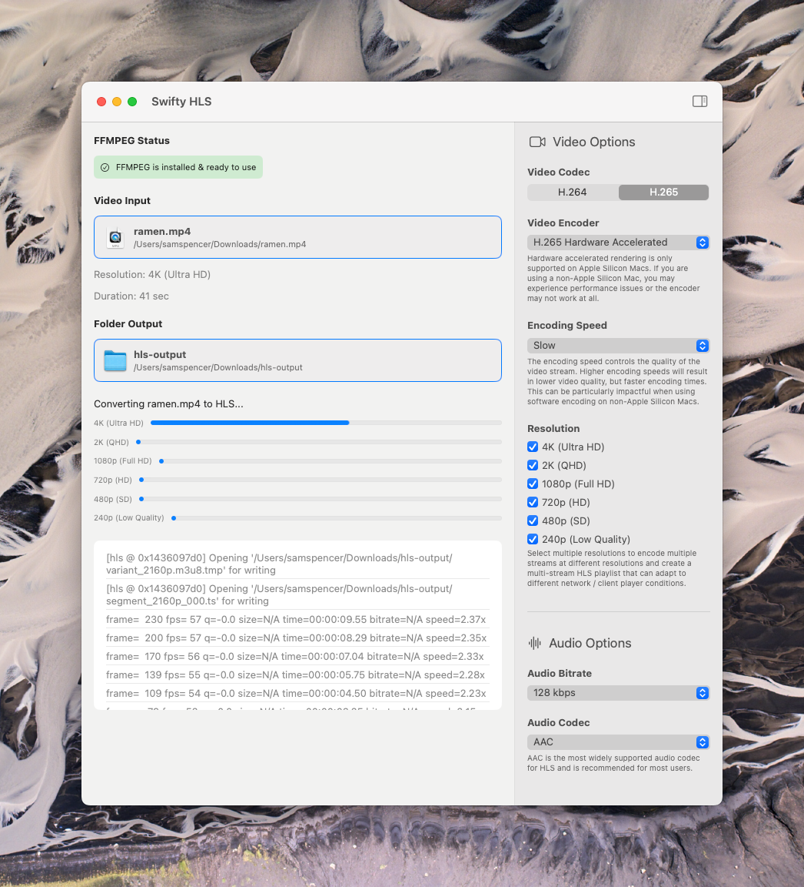
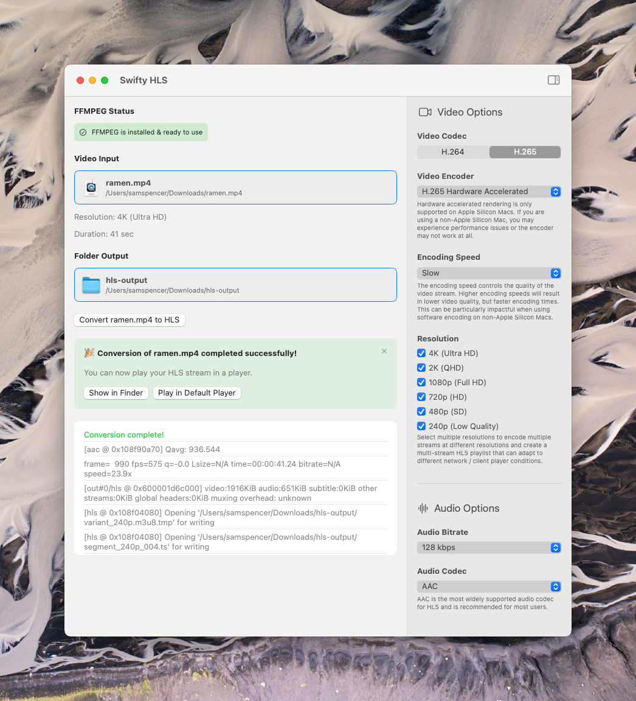

# HLS Beagle
Quickly transcode video using [FFMPEG](https://ffmpeg.org) into adaptive HLS streams. Includes a lovely Mac app and a handy Swift Package!

### What is this?
A super easy way to convert your video files into adaptive HLS streams! You can either integrate it into your Mac app using the included Swift Package. Or, if you're just looking to convert videos yourself, you can download and build the included Mac app and use the lovely GUI to start transcoding your videos.

### Why?
I recently started moving my own video projects off of Vimeo and onto my own server, and I found myself spending a lot of time figuring out how to get [FFMPEG](https://ffmpeg.org) to convert my videos properly... and also repeating a lot of bash scripts. This project provides a clean, type-safe API (and Mac app) to do just that.

### Why is it called HLS Beagle?
The [HMS Beagle](https://en.wikipedia.org/wiki/HMS_Beagle) was the ship that carried Charles Darwin around the world and helped him develop his theory of evolution. HLS is close to HMS. Seemed like a fun name! And there's a pun in there somewhere about *adapt*ive bitrates (eh? get it?). 🚢🤷

## Getting Started

### The Mac App
If you're looking for a quick and easy way to convert your existing video into adaptive HLS streams, you can use the included Mac app to do just that!

<p align="center">

</p>

It's as easy as dragging and dropping your input video and an output folder into the app, then clicking "Convert". The app respects your encoding preferences for audio and video, and will notify you when the conversion is complete.

#### Minimum Requirements
Use of the Mac app requires that you're running at least macOS 15.0 and have at least `homebrew` installed on your system (or that you're able to install FFMPEG yourself).

### The Swift Package
If you're interested in integrating this Swift wrapper over FFMPEG into your own project, you can use the included Swift Package to do so.

Just add the following URL as a package dependency in your macOS project:

```
https://github.com/Sam-Spencer/HLSBeagle.git
```

#### Minimum Requirements
Use of the Swift Package requires that your project target at least macOS 14.0 and use Swift 6 or later.

## License
HLS Beagle is licensed under the MIT License. It does not include a binary distribution of FFMPEG, as there are additional complex licensing hoops to jump through in order to do that. As such, APIs are provided as part of the Swift Package to check for the availability of FFMPEG on your system. Same goes for the Mac app: it will check for an existing install of FFMPEG before any conversions can take place.

## Contributing
Feel free to open an issue or pull request to report a problem, ask a question, or make a contribution! I'd love to expand this and make it more useful for others.
